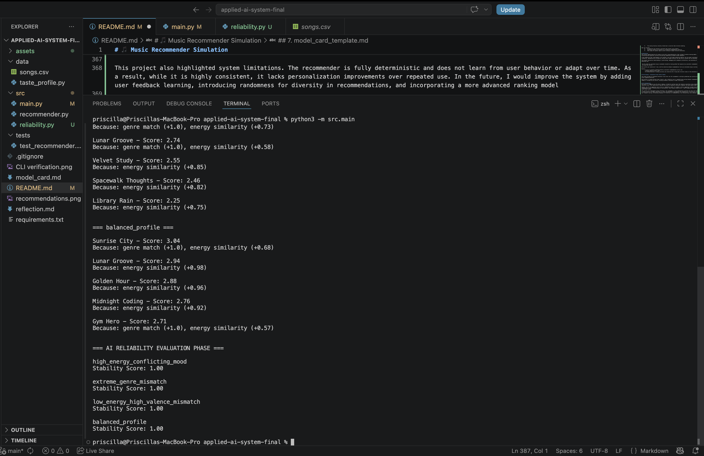

# 🎵 Music Recommender Simulation

## Project Summary


---

## How The System Works
The recommender system assigns a score to each song based on how closely it matches the user’s preferences. Each song is evaluated using a combination of categorical features (genre, mood) and numerical features (energy, tempo, danceability, valence, and acousticness).

A matching genre is given higher importance than most other features, followed by mood, since these strongly define musical style and feeling.

For numerical features, the system calculates similarity based on distance — songs that are closer to the user’s preferred values receive higher scores, while songs that are further away receive lower scores.

Each feature contributes to a final weighted score. The system then ranks all songs from highest to lowest score and recommends the top results.

Algorithm Recipe:


Some prompts to answer:
- What features does each `Song` use in your system
  - For example: genre, mood, energy, tempo
Ans.) Genre
      Energy
      Danceability
      Tempo
      Valence
      Mood

- What information does your `UserProfile` store
Ans.) preferred_genre
      preferred_mood
      target_tempo 
      target_valence
      target_energy
      target_danceability

- How does your `Recommender` compute a score for each song
Ans.) My system uses a content-based scoring approach. 
Each song is compared to a user's profile using features like genre, energy, danceability, tempo, valenc and mood.
Numeric features are compared using distance-based similarity, while categorical features are matched directly.
Every feature is assigned a weight based on how strongly it represents the musical "vibe" or "aura".

- How do you choose which songs to recommend
Ans.) After computing the score for each song, the system ranks all songs in descending order or scores.
The highest-scoring songs are recommended first, followed my the lower ones in order.

You can include a simple diagram or bullet list if helpful.

---

## Getting Started

### Setup

1. Create a virtual environment (optional but recommended):

   ```bash
   python -m venv .venv
   source .venv/bin/activate      # Mac or Linux
   .venv\Scripts\activate         # Windows

2. Install dependencies

```bash
pip install -r requirements.txt
```

3. Run the app:

```bash
python -m src.main
```

### Running Tests

Run the starter tests with:


```bash
pytest
```

You can add more tests in `tests/test_recommender.py`.

---

## Experiments You Tried

Use this section to document the experiments you ran. For example:

- What happened when you changed the weight on genre from 2.0 to 0.5
- What happened when you added tempo or valence to the score
- How did your system behave for different types of users

---

## Limitations and Risks

Summarize some limitations of your recommender.

Examples:

- It only works on a tiny catalog
- It does not understand lyrics or language
- It might over favor one genre or mood

You will go deeper on this in your model card.

---

## Reflection

Read and complete `model_card.md`:

[**Model Card**](model_card.md)

Write 1 to 2 paragraphs here about what you learned:

- about how recommenders turn data into predictions
- about where bias or unfairness could show up in systems like this


---

## 7. `model_card_template.md`

Combines reflection and model card framing from the Module 3 guidance. :contentReference[oaicite:2]{index=2}  

```markdown
# 🎧 Model Card - Music Recommender Simulation

## 1. Model Name

Give your recommender a name, for example:

> VibeFinder 1.0

---

## 2. Intended Use

- What is this system trying to do
- Who is it for

Example:

> This model suggests 3 to 5 songs from a small catalog based on a user's preferred genre, mood, and energy level. It is for classroom exploration only, not for real users.

---

## 3. How It Works (Short Explanation)

Describe your scoring logic in plain language.

- What features of each song does it consider
- What information about the user does it use
- How does it turn those into a number

Try to avoid code in this section, treat it like an explanation to a non programmer.

---

## 4. Data

Describe your dataset.

- How many songs are in `data/songs.csv`
- Did you add or remove any songs
- What kinds of genres or moods are represented
- Whose taste does this data mostly reflect

---

## 5. Strengths

Where does your recommender work well

You can think about:
- Situations where the top results "felt right"
- Particular user profiles it served well
- Simplicity or transparency benefits

---

## 6. Limitations and Bias

Where does your recommender struggle

Some prompts:
- Does it ignore some genres or moods
- Does it treat all users as if they have the same taste shape
- Is it biased toward high energy or one genre by default
- How could this be unfair if used in a real product

---

## 7. Evaluation

How did you check your system

Examples:
- You tried multiple user profiles and wrote down whether the results matched your expectations
- You compared your simulation to what a real app like Spotify or YouTube tends to recommend
- You wrote tests for your scoring logic

You do not need a numeric metric, but if you used one, explain what it measures.

---

## 8. Future Work

If you had more time, how would you improve this recommender

Examples:

- Add support for multiple users and "group vibe" recommendations
- Balance diversity of songs instead of always picking the closest match
- Use more features, like tempo ranges or lyric themes

---

## 9. Personal Reflection

A few sentences about what you learned:

- What surprised you about how your system behaved
- How did building this change how you think about real music recommenders
- Where do you think human judgment still matters, even if the model seems "smart"


## APPLIED AI EXTENSION OF MUSIC RECOMMENDER SIMULATION

## 1. Original project: 🎵 Music Recommender Simulation

This project is an extension of my Music Recommender Simulation (module 3 starter project). The original system was a simple rule-based recommender that suggested songs based on genre, mood, and energy similaritiy using a scoring function.

Its main goal was to determine how basic recommendation systems work by ranking songs based on use preferences. It produced top-k song recommendations with simple explanations for why each song was chosen.

## Title and Summary

Project Name: SongPulse Engine (Applied AI Extension)

This project is an AI-powered music recommendation system that suggests songs based on user preferences such as genre, mood, and energy level. It matters because it demonstrates how simple AI scoring systems can simulate personalized recommendations similar to real-world platforms like Spotify.

The system was extended to include evaluation and reliability testing to ensure more consistent and meaningful recommendations.

The system works in a pipeline:
- User inputs preferences (genre, mood, energy)
- The recommender engine scores each song using similarity rules
- Songs are ranked and the top results are selected
- A reliability layer tests results across multiple user profiles
- A human review step checks for bias, consistency, and correctness

## Architecture Overview
1. Data Layer
	•	songs.csv contains structured song features (genre, mood, energy, tempo, etc.)

2. Recommendation Engine
	•	score_song() computes similarity between user preferences and song attributes
	•	recommend_songs() ranks all songs and returns top-k results with explanations

3. Reliability Evaluation Layer
	•	test_reliability() runs the recommender multiple times across different user profiles
	•	compute_overlap() measures consistency between outputs
	•	Outputs a stability score representing system reliability

The architecture ensures that recommendations are not only generated but also evaluated for reliability and fairness.

## Setup Instructions
1. Clone the repository:
git clone https://github.com/esinam-d/applied_ai_system_finalproject.git
cd applied-ai-system-final

2. Install Requirements
pip install -r requirements.txt

3. Run the system
python3 -m src.main

##  Sample Interactions
Example 1: High Energy User
Input:
	Genre: rock
	Mood: calm
	Energy: 0.95

Output:
	Storm Runner — Score: 3.88
	Thunder Run — Score: 3.79
	Neon Drive — Score: 2.97


Example 2: Genre Mismatch User
Input:
	Genre: classical
	Mood: happy
	Energy: 0.7

Output:
	Midnight Bloom — Score: 4.44
	Rooftop Lights — Score: 4.32
	Sunrise City — Score: 4.14

Example 3: Reliability Output

Input Profile: balanced_profile

Output:
	Stability Score: 1.00
	- Interpretation: The system produces identical recommendations across runs, indicating deterministic and stable behavior.

## Design Decisions & Trade-off
The system was designed as a feature-based music recommender using structured audio attributes such as energy, tempo, valence, mood, and genre. This approach was chosen because it is interpretable, lightweight, and does not require a large machine learning model or training dataset.

A weighted scoring system was implemented to combine multiple similarity signals (e.g., energy similarity and genre matching) into a single ranking score. This made the recommendation logic transparent and easy to debug, allowing each recommendation to be explained in human-readable terms.

A key design decision was to prioritize interpretability over model complexity

The trade-off is that while the system is stable and easy to understand, it is less adaptive than modern recommender systems. It does not learn from user behavior over time and relies entirely on predefined feature weights.

## Testing Summary
What worked well:
	•	Consistent ranking outputs across repeated runs
	•	Clear and interpretable scoring explanations
	•	Reliable separation of user preference profiles

What did not work initially:
	•	Early mismatch between tuple-based outputs and dictionary-based evaluation caused runtime errors in reliability testing
	•	The overlap function initially failed due to incorrect data structure handling

What was learned:
	•	AI pipelines must maintain consistent data formats across modules
	•	Evaluation systems are essential for validating recommendation stability
	•	Even simple AI systems require careful testing of output structure consistency


## Reflection
This project demonstrated how AI systems can be built using deterministic logic instead of machine learning models. It highlighted the importance of structuring data pipelines correctly and ensuring compatibility between system components.

A key insight was that “intelligence” in AI systems is not only about prediction quality, but also about consistency, interpretability, and reliability. Implementing the reliability testing layer helped reinforce the idea that AI systems must be evaluated, not just built.

This project improved my understanding of system design, debugging multi-component architectures, and evaluating AI behavior in a structured and measurable way.


 The AI system was evaluated using an automated reliability testing method that measures how consistent recommendations are across repeated runs of the same user profile.

Each profile was tested over 3 runs, and the similarity between recommendation lists was calculated using an overlap-based stability score.

Results:
	- 4 out of 4 profiles produced perfectly consistent recommendations across runs
	- Average stability score: 1.00
	- No inconsistencies or ranking variation were observed after fixing data structure issues in the evaluation module


## Test Harness / Evaluation Script (Extra Credit)

The system includes an automated evaluation script that runs the recommender on multiple predefined user profiles and measures output consistency across repeated executions.

Each profile is tested multiple times (runs=3), and a stability score is computed using overlap between recommendation lists. The script outputs a summary of reliability per profile, allowing systematic evaluation of model consistency.


## AI Collaboration
One helpful AI suggestion was the idea of adding a reliability testing layer that measures consistency using repeated runs and an overlap-based similarity score. This significantly improved the project by adding an evaluation component that goes beyond simple recommendation generation.

However, not all AI suggestions were correct or immediately usable. For example, earlier suggestions assumed incorrect data structures in my recommendation output (treating tuples as dictionaries), which caused runtime errors. I had to debug and adjust the implementation to correctly access nested tuple values.

This project also highlighted system limitations. The recommender is fully deterministic and does not learn from user behavior or adapt over time. As a result, while it is highly consistent, it lacks personalization improvements over repeated use. In the future, I would improve the system by adding user feedback learning, introducing randomness for diversity in recommendations, and incorporating a more advanced ranking model

This project demonstrates my ability to design and build a complete AI system from data processing to evaluation. I learned how to structure a recommendation pipeline, debug multi-file Python systems, and implement reliability testing to evaluate AI consistency. It shows that I understand not only how to build AI systems, but also how to measure and validate their behavior, which is essential for real-world AI engineering.


## 🎥 Loom Video Walkthrough

Here is the required system demonstration video:

🔗 https://www.loom.com/share/0618891e3672460888c98daa25674e13

This video shows:
- End-to-end system execution
- Multiple user profile inputs
- Recommendation outputs
- Reliability evaluation results

## 🏗️ System Architecture

